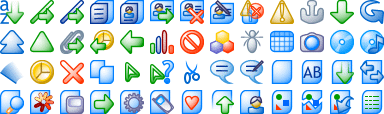

Phoenity
===

About
---

Phoenity is a whole family of icons, perfectly designed to be simple, modern and usable. It is available free for everyone, under the [Creative Commons License](http://creativecommons.org/licenses/by-sa/3.0/) or the [GNU Lesser General Public License](http://www.gnu.org/licenses/lgpl.html).

The Phoenity icons and artwork are created using [Xara Photo & Graphic Designer](http://www.xara.com/us/photo-graphic-designer/) (previously known as Xara Xtreme), [GIMP](http://www.gimp.org/) and [Paint.NET](http://www.getpaint.net/). There are two set of icons:

- Phoenity Aura
- Phoenity Classic (also known as the original Phoenity icons)

Phoenity Aura
---

- Located in the `icons/aura` folder.
- Firefox theme: [Phoenity Aura](https://addons.mozilla.org/en-US/firefox/addon/6278)

Phoenity Classic
---

- Located in the `icons/aura` folder and a few [legacy downloads](https://github.com/cheeaun/phoenity-icons/downloads)
- Firefox themes: [Phoenity Next](https://addons.mozilla.org/en-US/firefox/addon/7379/) and [Phoenity Classic](https://addons.mozilla.org/en-US/firefox/addon/7785/) by Xavius
- Thunderbird theme: [Phoenity Shredder](https://addons.mozilla.org/en-US/thunderbird/addon/9289/)
- Phoenity default theme for [K-meleon](http://kmeleon.sourceforge.net/wiki/KMeleonThemesWiki)
- [Phoenity skins for Opera](http://my.opera.com/community/customize/skins/tags/?tag=phoenity) by Lars Kleinschmidt

History
---

Phoenity got started as [a decent theme](http://forums.mozillazine.org/viewtopic.php?t=408&sid=c525eec45c28fa1f13a06ff00afcb6aa) for Firefox (formerly known as Firebird and Phoenix) on 4 November 2002. Initially, the Phoenity icons (now named as Phoenity Classic) are designed to be experimentally simple. Surprisingly, it became popular and ported to various other software.

Check out the [pre-Phoenity site](https://github.com/cheeaun/pre-phoenity) too.

---

Copyright (c) Lim Chee Aun. Dual-licensed under [Creative Commons Attribution-Share Alike 3.0](http://creativecommons.org/licenses/by-sa/3.0/) and [GNU Lesser General Public License](http://www.gnu.org/licenses/lgpl.html).
